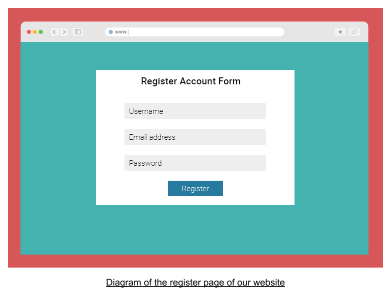
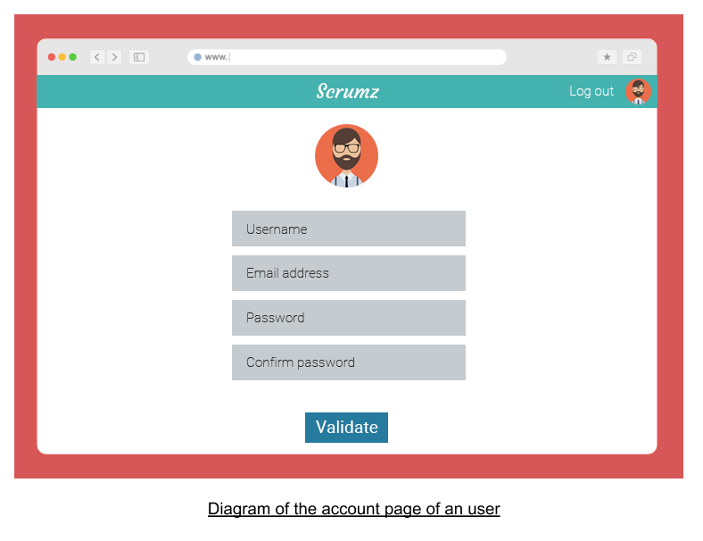
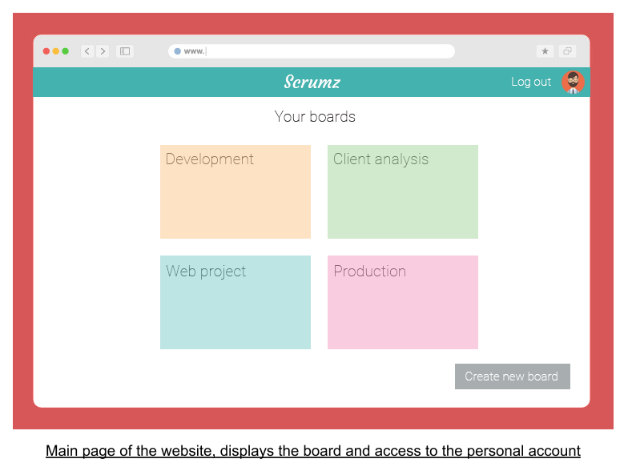
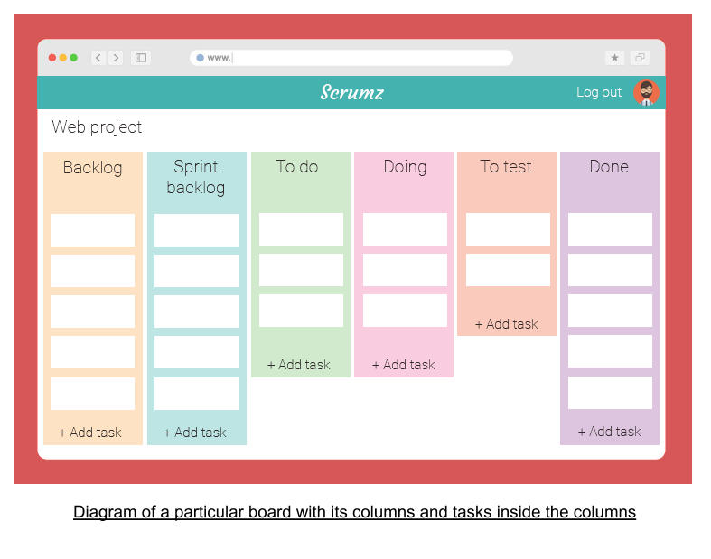

# Srumz
## UI
### Presentation

this is the render of the ui part of the project,
this is the chart we will follow :

this will be the look of the Login/ register Page

this will be the look of the editPage

this will be the look of the Home page

this will be the look of the project overview (the button add a card will only be in the first colomn)

### Instalation and run
to try the project execute  
`$npm install`  
and then  
`$npm start`
